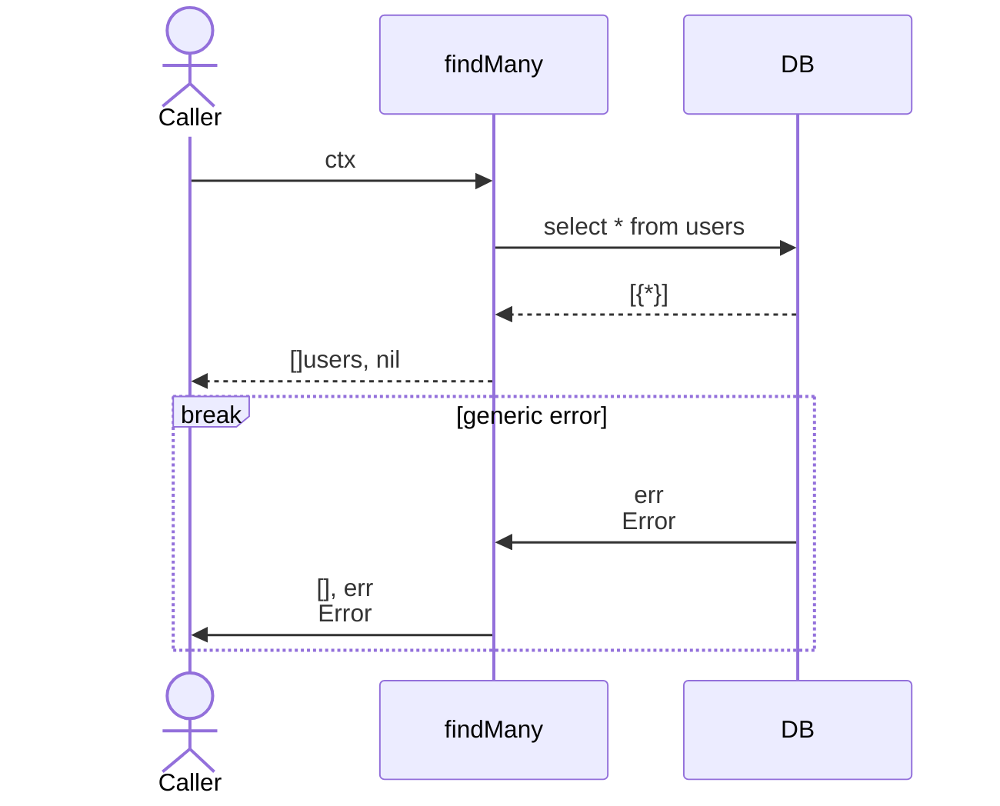

# User Repo FindMany

```
FindMany(ctx context.Context) ([]User, error)
```


```mermaid
sequenceDiagram
  actor c as Caller
  participant f as findMany
  participant db as DB

  c->>f: ctx
  f->>db: select * from users
  db-->>f: [{*}]
  f-->>c: []users, nil

  break generic error
    db->>f: err<br/>Error
    f->>c: [], err<br/>Error
  end

```