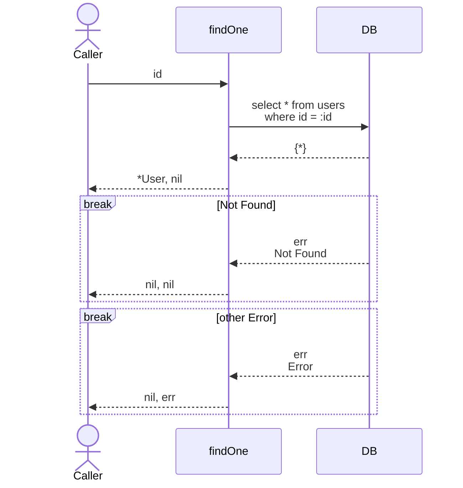

# User Repo FindOne

```
FindOne(ctx context.Context, id int) (*User, error)
```


```mermaid
sequenceDiagram
  actor c as Caller
  participant f as findOne
  participant db as DB


  c ->> f: id
  f ->> db: select * from users<br/>where id = :id
  db -->> f: {*}
  f -->> c: *User, nil

  break Not Found
    db -->> f: err<br/> Not Found
    f -->> c: nil, nil
  end

  break other Error
    db -->> f: err<br/>Error
    f -->> c: nil, err
  end

```