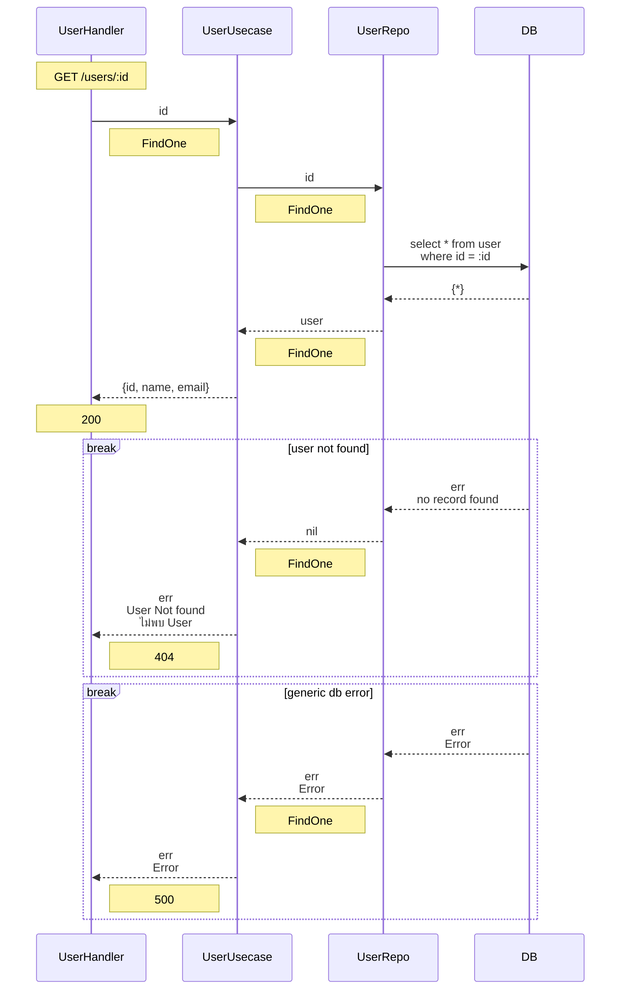

```mermaid
sequenceDiagram
  participant h As UserHandler
  participant u AS UserUsecase
  participant ur AS UserRepo
  participant db AS DB

  Note over h: GET /users/:id
  h ->> u: id
  Note left of u: FindOne

  u ->> ur: id
  Note left of ur: FindOne
  ur ->> db: select * from user<br/>where id = :id
  db -->> ur: {*}
  ur -->> u: user
  note left of ur: FindOne
  u -->> h: {id, name, email}
  note over h: 200

  break user not found
    db -->> ur: err<br/> no record found
    ur -->> u: nil
    note left of ur: FindOne
    u -->> h: err<br/>User Not found<br/>ไม่พบ User
    note left of u: 404
  end

  break generic db error
    db -->> ur: err<br/> Error
    ur -->> u: err<br/> Error
    note left of ur: FindOne
    u -->> h: err<br/> Error
    note left of u: 500
  end
```