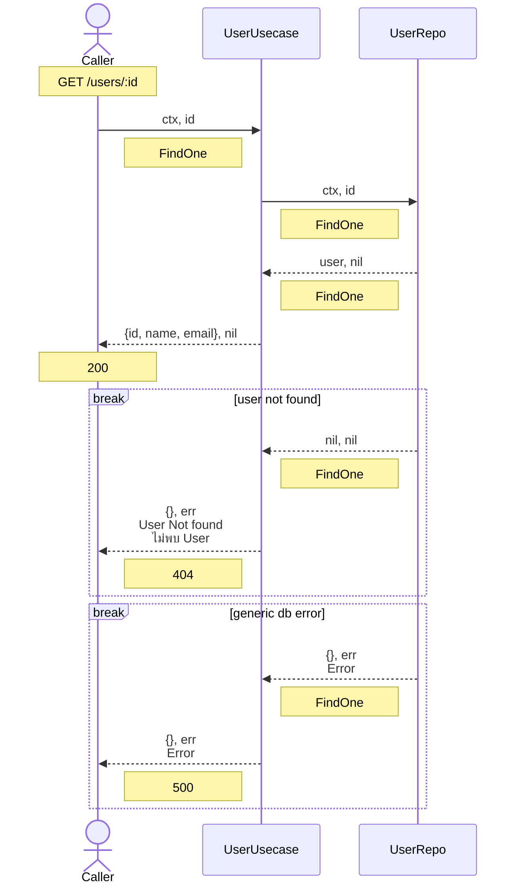

# User Usecase FindOne

```
FindOne(ctx context.Context, id int) (GetOneResp, apperr.Err)
```

### Response
```
type GetOneResp struct {
	ID    int    `json:"id"`
	Name  string `json:"name"`
	Email string `json:"email"`
}
```

